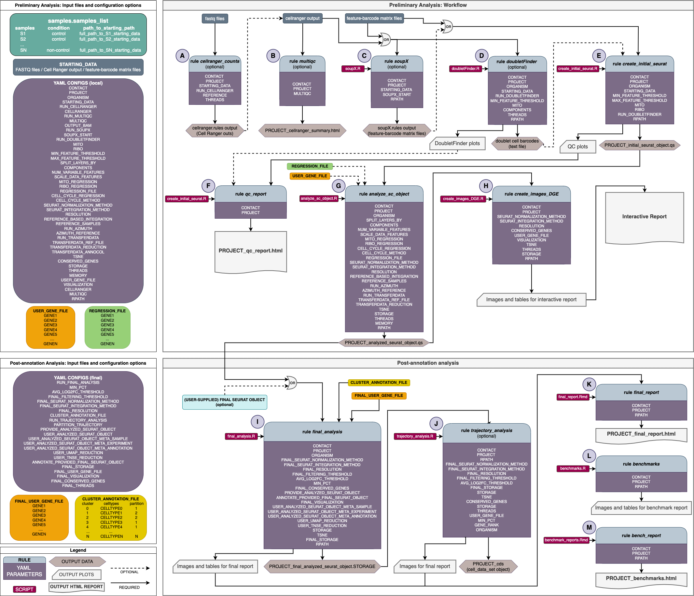
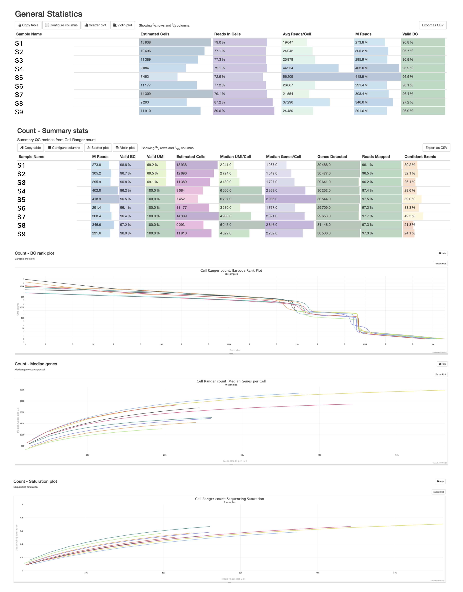
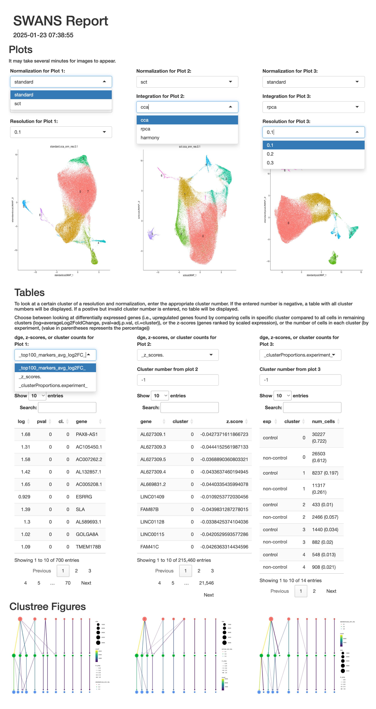
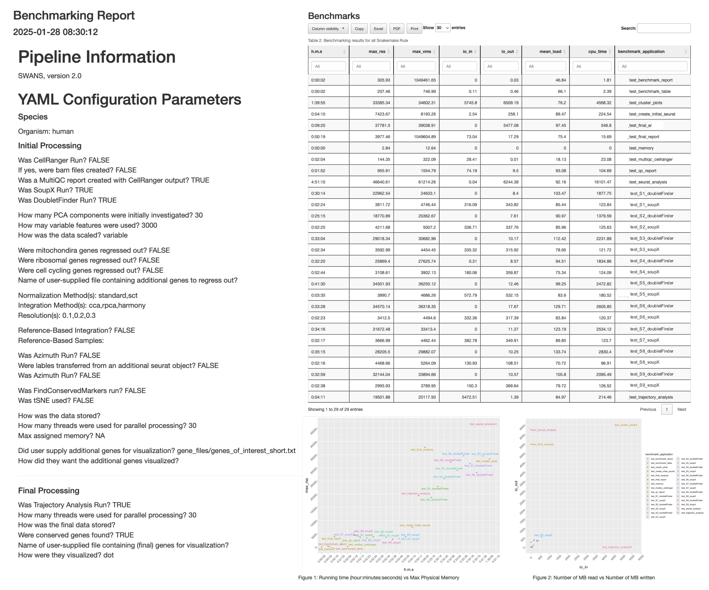
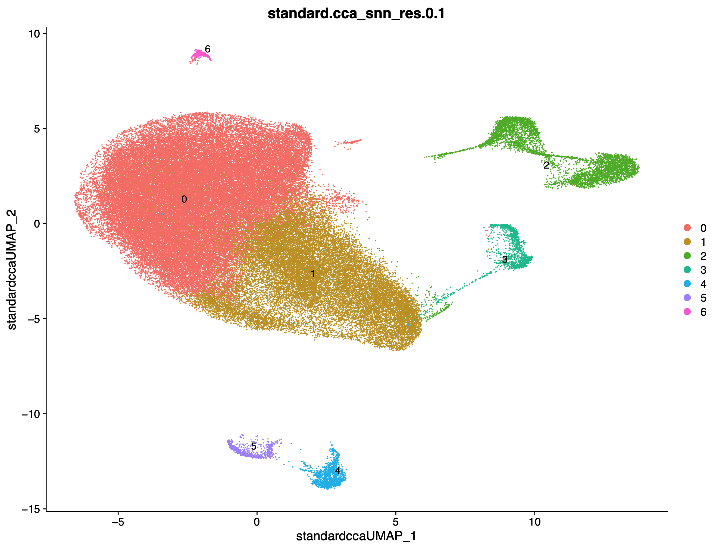

# SWANS 2.0: Single-entity Workflow ANalysiS Pipeline
* *******************************************************************************
## Motivation
Beyond analyzing data, the motiviation behind developing SWANS was related to a) how a bioinformatician can share massive amounts of complex data in a concise manner with investigators, b) have a devoted pipeline that can run a completely different analysis by changing configuration files, and c) how can an analysis be tweaked and the analyses compared to arrive at a one schema for additional downstream analysis. 

## Overview
SWANS analyzes single cell or single nuclei data and relies heavily on <a href="https://satijalab.org/seurat/" target="_blank">Seurat 5.1.0</a>, using Snakemake as a workflow manager, and YAML files to allow customization of the myriad of analysis parameters. The SWANS pipeline works with human or mouse organisms, one or multiple samples, and can run in parallel where Snakemake manages the resources behind the scenes. 

A unique aspect of SWANS is that, in a single pass, data can be analyzed using multiple normalization and integration methods as well as at multiple resolutions. This approach will create multiple clustering schemas (w/ accompanying DGEs/cluster) --- one of which presumably, is the best fit for the tissue and biological question(s).   

SWANS is designed to run a preliminary analysis and a post-annotation (final) analysis.   

### Preliminary Analysis
The preliminary analysis includes Cell Ranger, MultiQC (optional), QC (incl. optional SoupX/DoubletFinder), sample merging, clustering, and DGE analysis, z-score transformations, clustering characterization (cell counts/proportions), and visualization of all options among other items. An dynamic interactive report ([HTML + Shiny Report](#HTML)) is created to simultaneously display multiple UMAP clustering schemas, and related DGEs, z-scores, cell counts/proportions, and Clustree images to assist in choosing a final clustering schema.

### Final (Post-Annotation) Analysis
Once a final schema/approach is selected, clusters are renamed according to user specifications (see cluster_annotation_file), within-cluster dges are found by comparing transcriptional differences across experimental conditionals, and gene set enrichment analysis (gsea) is performed on each set of dges. additionally, transcriptional z-scores transformations and cell counts/proportions are calculated to characterize each cluster, each experimental conditional within each cluster, and each sample within each cluster. the is also the option to perform trajectory analysis -- the results of which are including the final analysis in an interactive html report that allows the investigator to review the results, answer their initial queries, and ask new questions. 

<p align="center">

</p>

* *******************************************************************************

# Running the pipeline
* *******************************************************************************
## Requirements
SWANS uses Snakemake with Singularity to execute each rule within a Singularity container. SWANS was built and tested using Snakemake version 7.32.4 and Singularity (singularity-ce) version 4.3.2-1.el8. The images for each phase of the analysis are specified in the `Snakefile` and `FinalSnakefile`. All rules with the exception of `rule cellranger_counts` use the 'POND' Docker image, while the `cellranger_counts` rule uses the 'cellranger' image. 

### Docker files
Docker images are loaded automatically with Singularity (no user action required). For those curious souls...Dockerfile locations:
- pond: `hub.docker.com/r/francothyroidlab/pond`
- cellranger: `hub.docker.com/r/francothyroidlab/cellranger`

For those who would like to make their own images, see docker_files in this repo.
- pond: `docker_files/POND/1.2/Dockerfile`
- cellranger: `docker_files/cellranger/9.0.1/Dockerfile`

## Run SWANS using the main bash script, `run_snakemake.sh`
Once the sample file (`samples.sample_list`) and the configuration files have been set up, the pipeline can be run from the SWANS repo directory with:

```bash
bash run_snakemake.sh
```
* *******************************************************************************

## Viewing the SWANS interactive report in RStudio:
### R packages (for running the interactive Shiny app)
```
yaml_2.3.10, magick_2.8.4, pdftools_3.4.0, rsconnect_1.3.1, dplyr_1.1.4, dt_0.33, shinyfullscreen_1.1.0, shinyjs_2.1.0, shiny_1.9.0
```

* *******************************************************************************

## Quick Start Guide
The SWANS pipeline will need to be run twice; the first pass will run the preliminary analysis, and the final pass will run the final analysis.  

You must have  the following files in your working directory: `samples.sample_list`, `configs/prelim_configs.yaml`, `configs/post_annotation_configs.yaml`, and when running the final analysis, you must also have a `cluster_annotation_file`.

You must also have FASTQ files, [Cell Ranger](https://support.10xgenomics.com/single-cell-gene-expression/software/pipelines/latest/what-is-cell-ranger) output (w/ `outs` directory), <b>or</b> feature-barcode matrix file outputs for each sample you would like to analyze. 

### Running Pipeline
In the directory containing `samples.sample_list`, `configs/prelim_configs.yaml`, and `configs/post_annotation_configs.yaml`, type `bash run_snakemake.sh`.   

* *******************************************************************************

#### samples.sample_list
<details>
  <summary>Click to expand!</summary>

Create a `samples.sample_list` file that will be placed at the top of your working directory (an example is included in this repo) and serves a few purposes: a) it defines which samples will be analyzed, b) it links each sample to an experimental condition, and c) it provides the location of the initial starting data (either FASTQ files (which will be processed via the cellranger count pipeline), Cell Ranger output (this option requires the path to point to folder **containing** the `outs` directory, _not_ the path to the `outs` directory), or feature-barcode matrix files (path points to folder containing features, barcodes, and matrix files, named exactly as `features.tsv.gz`, `barcodes.tsv.gz`, and `matrix.mtx.gz`, respectively). If there is more than one sample in the data set, the `samples.sample_list` file should have one sample name per line along with the experimental condition and path to starting data.  

**tabs separate `samples`, `condition`, and `path_to_starting_data` with no extra spaces or empty lines**. 

#### example 
```text
samples  condition   path_to_starting_data
a1 control  full_path_to_a1_cellranger_input_data_or_cellranger_output_data
a2 control  full_path_to_a2_cellranger_input_data_or_cellranger_output_data
a3 control  full_path_to_a3_cellranger_input_data_or_cellranger_output_data
b1 non_controls full_path_to_b1_cellranger_input_data_or_cellranger_output_data
b2 non_controls full_path_to_b2_cellranger_input_data_or_cellranger_output_data
```

#### Naming conventions for running Cell Ranger 
If you are starting with fastq files and one of your files is structured like this:

`HTS_SO108_41_276_G1_S6_R1_001.fastq.gz`, `HTS_SO108_41_276_G1_S6_R2_001.fastq.gz`   

The sample must be named accordingly: `HTS_SO108_41_276_G1`.

In the `samples.sample_list`, one of the lines should look similar to below.

`HTS_SO108_41_276_G1^IconditionX^Ipath_to_folder_holding_fastq_data/`
</details>

#### configs/prelim_configs.yaml
<details>
  <summary>Click to expand!</summary>

Customize the [configs/example_prelim_configs.yaml](configs/example_prelim_configs.yaml) file by supplying your email and other options that best correspond to the analysis you would like to perform (*e.g.,* human vs mouse...). Be sure to remove `example_` from the file name.

```yaml
# contact (email will be sent when jobs complete) 
CONTACT: user@email.com

# project name (in lower case) base_name: (name of output directory under `data/endpoints/`)
PROJECT: project_name

# organism (e.g., mouse, human)
ORGANISM: human
```

If you have FASTQ files, use `fastq`, if you have cellranger output (including outs dir), use `cellranger`. If you only have the feature-barcode matrix files (barcodes, features, matrix files), use `matrix`. If you are running Cell Ranger, you have the option of creating BAM files, which is a timely process and produces large files, but may be needed for specific purposes. You have the option to create collated report of the summary HTML Cell Ranger reports; this option will not work if `matrix` is the `starting_data`.

```yaml
# starting point data (e.g., fastq, cellranger, matrix)
STARTING_DATA: cellranger

# run cell ranger count pipeline (y/n)
RUN_CELLRANGER: y

# run multiqc on cell ranger output (y/n) -- must have outs/summary.html 
RUN_MULTIQC: n

# create bam file when running cellranger (slower) (y/n)
OUTPUT_BAM: n
```

<a href="https://github.com/constantamateur/soupx" target="_blank">Soupx</a> and <a href="https://github.com/chris-mcginnis-ucsf/doubletfinder" target="_blank">doubletfinder</a> are optional but recommended. Soupx removes background rna from the data set and doubletfinder detects multiple cells (attaching to one bead) presenting as one cell. for soupx, the user can have the cellranger output (recommended), the feature-barcode matrix files (features, barcodes, matrix), or an h5 file. 

```yaml
# run soupx (recommended) (y/n) 
RUN_SOUPX: y

# starting files for soupx: (outs, no_clusters, h5)
SOUPX_START: outs

# run doubletfinder (recommended) (y/n)
RUN_DOUBLETFINDER: y
```

If you are interested in changing the mitochondria or ribosomal filtering threshold, change the mito/ribo value.  
In an earlier draft of this pipeline, if single nucleus data was placed under the sequencing parameter (deprecated), setting a mitochondria threshold was not performed. However, experience has shown that nuclear-encoded mitochondrial proteins will show up. If exclusion of all cells expressing mito genes are requested, the mito value can be changed to 0. If all cells expressing mito genes should be retained, place the value at 100. **This is the exact same concept for ribo genes.**

```yaml
# mito cutoff (e.g., numeric value)
MITO: 15

# ribo cutoff (e.g., numeric value) (choose 100 for no filtering)
RIBO: 100 
```

Control which cells are retained/filtered

```yaml
# feature thresholds #
# e.g., s <- subset(s.merged, subset = nfeature_rna > 200 & nfeature_rna < 3000)
MIN_FEATURE_THRESHOLD: 200
MAX_FEATURE_THRESHOLD: 3000
```

When normalizing/scaling data, do you want to do so across experiments or samples (recommended)?

```yaml
# metadata by which to split the object into layers (experiment, sample (recommended)) -- advanced
SPLIT_LAYERS_BY: sample
```

You must provide an initial number of principal components to explore. a value like 200 will take considerably longer than 30, but regardless of the value, the 90\% of the variation is quantified, and that value is used for the remainder of the analysis.   

```yaml
# number of pcs to use in seurat (integer)
COMPONENTS: 30
```

When scaling/clustering, how many variable genes should be used, and should all or just the variable genes be used? Using a higher number of variable features will increase the computation time, and using all genes (vs variable) to scale data may be too computationally demanding for large datasets.

```yaml
# number of variable features (integer)
NUM_VARIABLE_FEATURES: 3000

# which features to use for scale data? (all or variable)
SCALE_DATA_FEATURES: variable
```

Mitochondira, ribosomal, and/or cell cycling genes can be regressed from the analysis. Users may also supply a list of additional genes (one gene per line) for regression. **The path to the regression_file must be relative and not absolute!!**

Note: Cell cycling regression not suggested when stem cells are quiescent and differentiated cells are proliferating.
<a href="https://satijalab.org/seurat/articles/cell_cycle_vignette" target="_blank">cell cycling methods</a>

```yaml
# should mito percent be regressed? (y/n)
MITO_REGRESSION: n

# should ribo percent be regressed? (y/n)
RIBO_REGRESSION: n

# file of additional genes to be regressed
REGRESSION_FILE:

# should cell cycle be regressed? (y/n)
CELL_CYCLE_REGRESSION: n

# which cell cycling method (standard, alternative) 
CELL_CYCLE_METHOD: standard
```

Some tissues may respond better to different approaches. Which resolution makes sense? Higher res = greater number of clusters. For effective <a href="https://github.com/lazappi/clustree">clustree</a>  images, it is recommended to use at least 5 sequential resolution values (e.g., 0.3,0.4,0.5).

```yaml
# normalization method for seurat (standard, sct) -- chose 1 or both
SEURAT_NORMALIZATION_METHOD: standard,sct

# integration method for seurat (cca, rpca, harmony) -- choose any combination or all options
SEURAT_INTEGRATION_METHOD: cca,rpca,harmony

# resolution value(s) examples: single value: 0.5; multiple values: 0.1,0.3.0.5 
RESOLUTION: 0.1,0.2,0.3
```

Computation time can be reduced for very large datasets by setting one or more samples as "references", to which all other samples will be aligned during integration process.

```yaml
# run integration in reference-based fashion? (y/n) (advanced)
REFERENCE_BASED_INTEGRATION: n

# which sample(s) to use as references for ref-based integration? (names from samples.sample_list)
REFERENCE_SAMPLES: 
```

Want to annotate your data with a compatible azimuth reference?

```yaml
# run azimuth annotation in seurat? (y/n)
RUN_AZIMUTH: n

# azimuth reference dataset to use for annotation
# human ref options: adiposeref, bonemarrowref, fetusref, heartref, humancortexref, kidneyref, lungref, pancreasref, pbmcref, tonsilref
# mouse ref options:  mousecortexref
AZIMUTH_REFERENCE: 
```

Want to supply an annotated seurat object to marry cell types to clusters? be specific with nomenclature.

```yaml
# run transferdata in seurat to annotate with a provided reference seurat object? (y/n)  (advanced)
RUN_TRANSFERDATA: n

# path to reference seurat object for transferdata? (path/to/seuratfile.storage)
TRANSFERDATA_REF_FILE: 

# which dimensional reduction in the transferdata_ref_file to use for transferdata?
TRANSFERDATA_REDUCTION: 

# which seurat meta.data column to use for transferdata annotation? 
TRANSFERDATA_ANNOCOL:
```

t-SNE plots can be excluded from or added to the output pdfs. conserved genes can be found if there is > 1 experimental condition. finding conserved genes can be time consuming for large datasets with multiple experimental conditions. 

```yaml
# make tsne plots (y/n)
TSNE: n

# run conserved genes (y/n) -- only run with multiple experiments
CONSERVED_GENES: n
```

The final analyzed data can be saved as a rds (default: qs file (significantly faster to read/save)). The analyzed data can also be converted to a single cell experimental object. The user may choose one or all storage options.

```yaml
# storage format (rds,sceo)
STORAGE: 
```

Threads is available to those with parallel computing capabilities.

```yaml
# number of threads
THREADS: 30
```

This can be set is there is some max memory threshold you do not want to surpass.

```yaml
# max memory (write out fully in bytes, e.g., 1689064417920, not 1.69t)
MEMORY: 1389064417920
```

User may optionally supply list of genes where their expression will be plotted on feature plots (umap), (optional: violin plots, dot plots, and ridge plots). **The path to the regression_file must be relative and not absolute!!**  the file must contain one gene per row. If the user does not wish to supply genes, leave the field blank.

```yaml
# relative path with filename to file containing genes of interest (optional)
USER_GENE_FILE: 

# which visualization for user_gene_file (violin,ridge,dot) -- choose 1, more, or leave blank
# (feature plotted by default) choosing all will create very large pdf file that may be challenging to open
VISUALIZATION: dot 
```

</details>

#### configs/post_annotation_configs.yaml
<details>
  <summary>Click to expand!</summary>
 <br> 

Customize the [configs/example_post_annotation_configs.yaml](configs/example_post_annotation_configs.yaml) file by supplying your email and other options that best correspond to the analysis you would like to perform (*e.g.,* human vs mouse...). Be sure to remove `example_` from the file name.

**The first time running swans, set run_final_analysis to n!** do not set run_final_analysis to y until the initial analysis has completed and you are ready to label (annotate) your cells, perform dge across experimental conditions for each cluster, retrieve pathway analysis results, and optionally perform cursory trajectory analysis.

```yaml
# run finale (y/n)
RUN_FINAL_ANALYSIS: n
```

The user must select a final resolution, a final normalization method (standard, sct), and a final integration method (cca, harmony, rpca) to move forward. They must also provide the cluster_annotation_file file (see below). **The path to the cluster_annotation_file must be relative and not absolute!!** 

```yaml
# final normalization method for seurat (standard, sct) -- choose only one
final_seurat_normalization_method: standard

# final integration method for seurat (cca, rpca, harmony) -- choose only one
FINAL_SEURAT_INTEGRATION_METHOD: harmony

# final resolution value -- single value: e.g., 0.5
FINAL_RESOLUTION: 0.1

# file with names of new clusters
CLUSTER_ANNOTATION_FILE: 
```

DGE specs and filtering pathway/gsea results

```yaml
# minimimum % of cells in one of compared groups for dge
MIN_PCT: 0.1

# filtering threshold/value of adj.p.value for pathway/gsea results -- single value: e.g., 0.05 
FINAL_FILTERING_THRESHOLD: 0.10
```

Want to run cursory trajectory analysis? If the user is running trajectory analysis with monocle3 and wants to partition the cell clusters for trajectory analysis, `PARTITION_TRAJECTORY` should be set to `y`. If this column is not supplied in the `CLUSTER_ANNOTATION_FILE`, `PARTITION_TRAJECTORY` should be set to `n`, and the Monocle3 trajectory analysis will run without partitions.

```yaml
# run Monocle3 trajectory analysis? (y/n) -- optional
RUN_TRAJECTORY_ANALYSIS: n

# partition clusters (y/n) 
# if y, CLUSTER_ANNOTATION_FILE needs a column called 'partition' with a value for each cluster
PARTITION_TRAJECTORY: y
# --------------------------------------------
```

Want to supply your own seurat object? Be specific or it will likely crash.

```yaml
# -- SUPPLYING SEURAT OBJECT ----------------

# supply final Seurat object (y/n)
PROVIDE_ANALYZED_SEURAT_OBJECT: n

# path to seurat object -- cannot be blank if PROVIDE_ANALYZED_SEURAT_OBJECT = 'y'
USER_ANALYZED_SEURAT_OBJECT: 

# meta data character string to access 'Sample' in seurat object (e.g., Samples, sample_name')
USER_ANALYZED_SEURAT_OBJECT_META_SAMPLE:

# meta data character string to access 'Experiment' in seurat object (e.g., Experiment, Conditions)
USER_ANALYZED_SEURAT_OBJECT_META_EXPERIMENT:

# meta data character string that holding annotation information in seurat object (e.g., celltypes, annotation_layer)
USER_ANALYZED_SEURAT_OBJECT_META_ANNOTATION:

# umap reduction in supplied seurat object (e.g., standard.cca.umap)
USER_UMAP_REDUCTION:

# tsne reduction in supplied seurat object (e.g., standard.rpca.tsne)
USER_TNSE_REDUCTION:

# use only if providing annotated ANALYZED_SEURAT_OBJECT
# annotate seurat object? (y/n)
ANNOTATE_PROVIDED_FINAL_SEURAT_OBJECT:
# --------------------------------------------
```

What additional ways do you want your final output (qs default)?

```yaml
# final storage format (rds,sceo,cloupe,cellchat)
FINAL_STORAGE: 
```

Optionally, the pipeline can perform cursory trajectory analysis. The following parameters may be used optionally for trajectory analysis.

```yaml
# run Monocle3 trajectory analysis? (y/n) -- optional
RUN_TRAJECTORY_ANALYSIS: y

# if y, CLUSTER_ANNOTATION_FILE needs a column called 'partition' with a value for each cluster
PARTITION_TRAJECTORY: y
```

```yaml
# relative path with filename to file containing genes of interest
FINAL_USER_GENE_FILE: 

# which visualization for FINAL_USER_GENE_FILE (violin,ridge,dot) -- choose 1, more, or leave blank
# (feature plotted by default) choosing all will create very large pdf file
FINAL_VISUALIZATION: dot

# run conserved genes (y/n) -- only run with multiple experiments
FINAL_CONSERVED_GENES: n

# number of threads
FINAL_THREADS: 30
```
</details>

#### CLUSTER_ANNOTATION_FILE
<details>
   <summary>Click to expand!</summary>

The `CLUSTER_ANNOTATION_FILE` can have just about any name (the first character of the file name must be a letter (e.g., no numbers)). Include the _**relative path**_ to `CLUSTER_ANNOTATION_FILE` in `configs/post_annotation_configs.yaml`! The header must be tab-separated as below (e.g., `cluster^Icelltype^Ipartition` where `^I` represents a tab). On each line, the cluster number, cell type, and partition (for trajectory analysis) must also also separated by a tab.

If the user is running trajectory analysis with Monocle3 and wants to partition the cell clusters for trajectory analysis, an additional column named `partition` needs to be supplied in the `CLUSTER_ANNOTATION_FILE`. The partitions should be numbers (integers). All clusters must be assigned to a partition (i.e., none can be left blank). If this column is not supplied in the `CLUSTER_ANNOTATION_FILE`, `PARTITION_TRAJECTORY` should be set to `n`, and the Monocle3 trajectory analysis will run without partitions.

```
cluster  celltypes  partition
0        a1         1
1        a2         1
2        a3         1
3        b1         2
4        b2         2
5        c1         3
6        d1         3
7        e1         4
8        a4         1
```
</details>

#### Output Structure
<details>
  <summary>Click to expand!</summary>

After typing `swans` from the commandline, ...
```text
├── data     
     ├── endpoints    
     │   └── project_name    
     │       └── sample_name1     
     │           ├── sample_name1_s15_r1_001.fastq.gz (symlink if cellranger)    
     │           ├── sample_name1_s15_r2_001.fastq.gz (symlink if cellranger)    
     │           ├── symlink_to_cellranger_output_containing_outs_dir_sample_name1 (symlink if cellranger output)    
     │           ├── symlink_to_folder_containing_matrix_files_sample_name1 (symlink if matrix)    
     │           ├── cellranger/ or matrix/    
     │           ├── doubletfinder (optional)    
     │           |  ├── figures    
     │           |  ├── tables    
     │           ├── soupx (optional)    
     ...    
     │       └── sample_namen     
     │           ├── sample_namen_s15_r1_001.fastq.gz (symlink if cellranger)    
     │           ├── sample_namen_s15_r2_001.fastq.gz (symlink if cellranger)    
     │           ├── symlink_to_cellranger_output_containing_outs_dir_sample_namen (symlink if cellranger)    
     │           ├── symlink_to_folder_containing_matrix_files_sample_namen (symlink if matrix)    
     │           ├── cellranger/ or matrix/    
     │           ├── doubletfinder (optional)    
     │           |  ├── figures    
     │           |  ├── tables    
     │           ├── soupx (optional)    
     │       └── analysis     
     │           ├── figures    
     │           ├── final_analysis (post annotation only)    
     |           |   ├── `project_name_final_report.html` ** html report for final (post-annoatation) analysis
     │           |   └── figures     
     │           |   └── pathway_analysis     
     │           |   |  ├── tables    
     │           |   |  ├── figures    
     │           |   └── tables     
     │           |   |  ├── conserved_genes (optional)    
     │           |   └── trajectory_analysis     
     │           |   |  ├── cds    
     │           |   |  ├── figures    
     │           ├── normalization    
     │           |   └── sct (if sct listed in yaml file)    
     │           |   |  ├── tables    
     │           |   |  ├── figures    
     │           |   └── standard  (if standard listed in yaml file)    
     │           |   |  ├── tables    
     │           |   |  ├── figures    
     │           ├── rds    
     │           ├── report    
     │           |   ├── project_name_qc_report.html ** qc html report 
     │           |   └── benchmarks     
     │           |   |  ├── project_name_benchmark_report.html ** html report on resources (memory/time) used for analysis
     │           |   |  ├── figures    
     │           |   |  ├── table    
     │           |   └── cellranger     
     │           |   |  ├── project_name_cellranger_summary_data    
     │           |   └── compare_images     
     │           |   └── figures     
     │           |   |  ├── clustree    
     |           |   ├── interactive_report.rmd ** interactive report for prelim analysis
     │           |   └── tables     
     │           ├── tables    
```    
</details>

* *******************************************************************************

## Reports

Four (five, if optional report is run) separate reports are included in the output: MultiQC (optional), QC Report, Interactive Report, Benchmarking Report, & Final Report.

#### MultiQC Report (optional)
<details>
  <summary>Click to expand!</summary>

location: `data/endpoints/project_name/analysis/reports/cellranger/project_name_multiqc_cellranger_summary.html`  

This is an optional report that can only be created if Cell Ranger is being run or you are starting with Cell Ranger data. MultQC will create a report that gives you an overview of your data quality. It is a good idea to inspect this report to make sure for example, you have a healthy number of cells for each sample.



</details>


#### QC_report
<details>
  <summary>Click to expand!</summary>

location: `data/endpoints/project_name/analysis/reports/project_name_qc_report.html`  

This file contains information on doublets, the number of genes and cells in each sample as well as RNA counts, and the abundance/cell of mitochondria and ribosomal genes both pre- and post-filtering. There will be one UMAP plot of the final DoubletFinder classifications for each sample in the dataset. 


</details>


#### HTML + Shiny Report
<details>
  <summary>Click to expand!</summary>


location: `data/endpoints/project_name/analysis/reports/Interactive_report.Rmd`  

After `src/rules/create_images_DGE.rules` has successfully ran, users can inspect the differentially expressed genes and UMAP images in an interactive report (`Interactive_report.Rmd`). Interactive files are located under `data/endpoints/project_name/analysis/report/` and will allow the user to compare multiple clustering schemes simultaneously in a R-studio environment. There is a file in the report directory (`Interactive_report.Rmd`). Set the working directory as the `report/` folder and load the Rmd file into Rstudio, install necessary packages, then hit `Run Document`. The interactive shiny app will provide users with an overview of the analysis as seen below.

 

Under `Plots` in the Interactive Report, the user can choose normalization method, integration method, and a resolution, and the UMAP image matching those specifications will appear (and will update if selections are changed). Under `Tables`, the top 100 genes (`dge`) for each cluster in the schemata above can be shown, or the genes ordered by z-score can be shown for each cluster, or the number of cells in each experimental group can be shown by cluster. This allows users to compare cluster markers (dge), z-scores, and the number of cells by experimental group across up to 3 different configurations.

Lastly under `Clustree Figures`, for the selected normalization and integration method, a <a href="https://github.com/lazappi/clustree">Clustree</a> image is created that allows the users to see how cells move from one cluster to another as a function of resolution, and allows users to see when when over clustering occurs.  

Use this tool to explore the data and choose one clustering arrangement for downstream analysis. This marks the end of the preliminary analysis; a completed `CLUSTER_ANNOTATION_FILE` is required to complete the analysis. 
</details>

#### Benchmarking
<details>
  <summary>Click to expand!</summary>  

location: `data/endpoints/project_name/analysis/reports/benchmarks/project_name_benchmark_report.html`

There is a benchmarking report comprised on quantitative metrics for each step within the entire analysis. Individual benchmark logs can be found in the working directory under `benchmarks/project_name/`.


</details>

#### Final Report

<details>
  <summary>Click to expand!</summary>  

location: `data/endpoints/project_name/analysis/final_analysis/project_name_final_report.html`

This report will contain the following:
  * an overview of samples and what parameters were used for the analysis
  * annotated UMAP images (overall, split by experiment, split by sample, & phase)
  * Bar plots/tables of cell counts/proportions for each cluster (overall, split by experiment, split by sample)
  * DGEs by cluster
  * Two tables of GSEA/Pathway results (DGEs ranked by adj.p.value & avglog2FG)
  * conserved genes (by cluster) -- optional
  * Z-score transcript transformation by cluster, by cluster/experiment, & by cluster/sample
  * Heat map of top 75 most variable genes, table of all variable genes
  * Trajectory analysis plot (optional)


</details>

* *******************************************************************************

## Additional Output
<details>
  <summary>Click to expand!</summary>

Under `data/endpoints/project_name/analysis/normalization/` will be PDFs containing various umap images, cluster proportions by sample, and visualization of any user-supplied genes. For example, with the configurations below...

```yaml
# normalization method for Seurat (standard, sct) -- choose one or all
SEURAT_NORMALIZATION_METHOD: sct,standard

# integration method for seurat (cca, rpca, harmony) -- choose one or all
SEURAT_INTEGRATION_METHOD: rpca,cca,harmony

# resolution value(s) examples: single value: 0.5 multiple values: 0.1,0.3,.0.5
RESOLUTION: 0.1,0.2,0.3
```

There will be two subfolders under `data/endpoints/project_name/analysis/normalization/`, `sct/[figures/][tables/]`, and `standard/`. 
```text
     │       └── analysis 
     │           ├── normalization
     │             └── sct (if sct listed in YAML file)
     │                ├── tables
     │                ├── figures
     │             └── standard  (if standard listed in YAML file)
     │                ├── tables
     │                ├── figures
```

Under figures will be PDFs named as follows: `project_name_DimPlot_Proportions_SEURAT_NORMALIZATION_METHOD.SEURAT_INTEGRATION_METHOD_snn_res.RESOLUTION.pdf`. In this example we have 2 normalization methods, 3 integration methods, and 3 resolutions, therefore, there will be 18 UMAP configurations. If `SEURAT_NORMALIZATION_METHOD == 'sct'`, related PDFs (and tables) will be found in the `sct/` subfolder, ditto for `standard`. 

An example snapshot of the PDF can be seen below:  
 

**Note: feature plots are plotted by default, dotplots, violin plots, and ridgeplots must be specificed under `VISUALIZATION` in the `configs/prelim_configs.yaml` file.**

For each possible configuration, there will be a proportions file and DEG results file (for each cluster) in the tables subfolders, and titled as follows:   
a) `project_name_clusterProportions_SEURAT_NORMALIZATION_METHOD.SEURAT_INTEGRATION_METHOD_snn_res.RESOLUTION.txt`.   
b) `project_name_markers_SEURAT_NORMALIZATION_METHOD.SEURAT_INTEGRATION_METHOD_snn_res.RESOLUTION.txt`.   

a) will contain the number of cells per cluster by sample   
b) will contain the upregulated genes for each cluster  
</details>

* *******************************************************************************

## Suggestions
<details>
  <summary>Click to expand!</summary>

- This pipeline can create many UMAP configurations based on user input. Using the example above (2 normalization methods, 3 integration methods, and 3 resolutions), there will be 18 UMAP configurations...and that means there will also be 18 DGE files (each file is split by cluster therein). We have created a dynamic interactive report to help compare schemas/DEGs, but at the end of the day, someone will need to parse through all the data to make a decision. 

- There is no way to run SWANS if the starting data is a mix of FASTQ files and `outs` from Cell Ranger. If this is your situation, run the pipeline on the FASTQ samples only by limiting the `samples.sample_list` to the FASTQ files and make sure you have configured the `prelim_configs.yaml`file to `y` for `RUN_CELLRANGER`.  Monitor your output (e.g., create MultiQC report), and when it appears, stop the pipeline. You will need to redo your samples file and your configuration file to include correct paths and to no longer run cellranger/multiqc, and consider using a different `PROJECT` name. 

- If you are doing differential gene expression analysis and the UMAP has a large single body split into multiple clusters, you will not get useful annotation markers for those clusters because `FindAllMarkers` compares each cluster to all cells in the remaining clusters in the data. Using the schema below as an example, when comparing cluster 0 to the combined cells in clusters 1, 2, 3, 4, 5, and 6, here are some things to note: 
	- the largest cluster is `0` followed by cluster `1`
	- the number of cells in cluster `1` looks to be larger than the collective number of cells in clusters 2-6  
	- dge results will likely highlight differences between clusters `0` and `1` when using `FindAllMarkers`, ditto for cluster `1` vs all cells 
 

 In such cases, a) if there are annotation candidates, those could be provided in a file and listed under `USER_GENE_FILE` in the `prelim_configs.yaml` file or b) the two clusters could be combined manually. Authors suggest `a)` as there are expected names/formats in the Seurat object that would not be present if manually altered, but we have attempted to address this by providing z-scores transformation on transcript expression.

- If you are running approximately 12 or more samples (each having ~15,000 cells) and `sct` is included as a normalizing method and `RPCA` is included as an integration method, the analysis may stall without throwing an error. This is not an issue with the pipeline, it is an issue with the future R package that impacts certain Seurat functions when running things in parallel. This is a known issue (https://github.com/satijalab/seurat/issues/9706), that can be solved by setting the THREADS equal to 1. It will take longer to run, but that gives you more time to enjoy some coffee/tea/RO water.
</details>

* *******************************************************************************

## Troubleshooting Pipeline
<details>
  <summary>Click to expand!</summary>

#### Checking Log Files
Each rule will create a log file specific to the rule. Regardless if the pipeline completes without an error, an email will be sent to the address in the config file, and will be one of the two below:
```python
onsuccess:
   print("The main controller pipeline completed with no errors.")
   shell("mail -s 'The main controller pipeline completed with no errors.' "+ config['contact']+" < {log}")

onerror:
   print("The main controller pipeline did not complete without errors."),
   shell("mail -s 'The main controller pipeline did not complete without errors, check the logs and try again.' "+ config['contact']+" < {log}")
```

If there is a failure, there will be additional information in the email (as well as printing the error to the screen where the pipeline is being run). For example...  

```text
Error in rule final_analysis:
    jobid: 4
    input: src/scripts/final_analysis.R, data/endpoints/project_name/analysis/RDS/project_name_analyzed_seurat_object.qs, gene_files/cell_annotation_project_name.txt
    output: data/endpoints/project_name/analysis/RDS/project_name_final_analyzed_seurat_object.qs, data/endpoints/project_name/analysis/RDS/project_name_final_analyzed_seurat_object.qs
    log: logs/project_name/final_analysis/project_name_final_analysis.log (check log file(s) for error details) **THIS IS WHERE THE LOG FILE IS SAVED**
    shell:
        Rscript src/scripts/final_analysis.R project_name /usr/local/lib/R/site-library/ data/endpoints/project_name/analysis/RDS/project_name_analyzed_seurat_object.qs 			standard harmony 0.2 			gene_files/cell_annotation_project_name.txt n gene_files/goi_final_project_name.txt 30 			0.1 1.5 0.1 			y 			human qs n  			None dot Sample 			Experiment celltypes 			None None 812454943216 			2> logs/project_name/final_analysis/project_name_final_analysis.log
        (one of the commands exited with non-zero exit code; note that snakemake uses bash strict mode!)

Shutting down, this might take some time.
Exiting because a job execution failed. Look above for error message
mail -s 'The final analysis pipeline did not complete without errors, check the logs and try again.' user@email.com < blahblah_lab/SWANS2.0/.snakemake/log/2025....snakemake.log
```

Read the `logs/project_name/final_analysis/project_name_final_analysis.log` file for specific error information to aid in debugging.  
#  

#### Inspect Actual Command
The other item that will be in the email (and printed onscreen) is the actual command that was used to run a particular rule. If you are having issues running the pipeline to its conclusion, look at the actual command and see if any parameters are missing.
</details>

* *******************************************************************************

## Author & Owner
<a href="https://github.com/errcricket" target="_blank">Erin R. Reichenberger</a>

* *******************************************************************************

## Submitting Issues
For all issues and questions, please [submit an Issue on GitHub](https://github.com/FrancoResearchLab/SWANS/issues/new) with as much information as possible. 

* *******************************************************************************

## How to cite
Katherine Beigel, Eric Wafula, Dana V Mitchell, Steven J Pastor, Michelle Gong, Robert Heuckeroth, Julio C Ricarte-Filho, Aime T. Franco, Erin R Reichenberger. 2025.
SWANS: A highly configurable analysis pipeline for single-cell and single-nuclei RNA-sequencing data

bioRxiv doi: https://doi.org/10.1101/2025.05.14.654073 
* *******************************************************************************

## License
Licensed under the GNU License and MIT License. See the [license.txt](licenses/license.txt) file.


